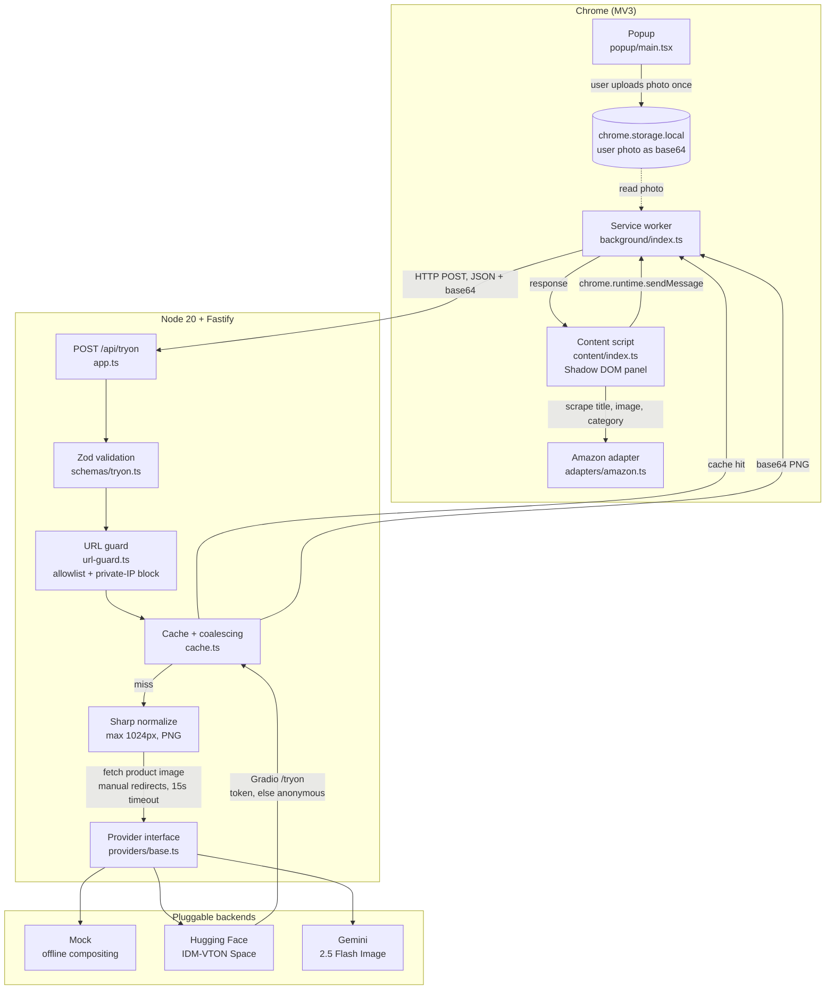

# Architecture

## Why a backend exists at all

The obvious design is to call the model straight from the extension. That fails for
three reasons, and each one is why a specific piece of this system exists:

| Problem | Why the extension can't solve it | Where it's solved |
| --- | --- | --- |
| An API key in an extension is public — anyone can unpack a `.crx` | MV3 bundles ship to the user's disk | Key lives in `backend/.env`, never leaves the server |
| Amazon's CDN blocks cross-origin reads from page context | Browser CORS policy | Server fetches the product image (`tryon-service.ts`) |
| The GPU quota is small and shared | No way to coordinate across tabs | Cache + in-flight coalescing (`cache.ts`) |

## Request flow

## The four runtimes

Each has different powers, and the split is forced by Chrome's security model — not
by preference.

| Runtime | Can it see the page? | Can it bypass CORS? | Job here |
| --- | --- | --- | --- |
| **Popup** | No | No | Capture and store the user photo once |
| **Content script** | Yes (DOM) | No | Scrape the product, inject the UI |
| **Service worker** | No | Yes, via `host_permissions` | Network broker; holds no UI state |
| **Node backend** | No | N/A (not a browser) | Secrets, image work, model calls |

The content script cannot call the backend directly without CORS trouble, and the
service worker cannot read the DOM. So they split the work and talk over
`chrome.runtime.sendMessage`.

## Quota protection

IDM-VTON runs on Hugging Face **ZeroGPU**, which enforces a per-account daily quota.
An earlier version of this project burned a full day's quota in about 30 seconds
because the Regenerate button was never disabled during a request. Three layers now
prevent that:

1. **Client** — both buttons disable while a request is in flight, and an `inFlight`
   flag rejects overlapping calls even if the DOM state is wrong.
2. **Coalescing** — identical concurrent requests share a single upstream generation
   (`ResultCache.resolve`). Three clicks, one GPU slot.
3. **Cache** — an LRU with TTL, keyed by
   `sha256(normalized user image + product URL + category + title + prompt version + provider + steps)`.
   Hashing the *normalized* bytes keeps the key stable across client re-encodes.

Bumping `PROMPT_VERSION` in `prompts.ts` invalidates the cache, so prompt edits never
serve stale results.

## Anonymous fallback

`HuggingFaceTryOnProvider` tries the configured token first. If the error looks like a
quota rejection it reconnects **without** a token, because guest access draws from a
separate IP-keyed pool. That pool is smaller, so it is a safety net rather than a
supply — but it keeps a demo alive after the account quota is spent.

## SSRF defence

`product_image_url` is caller-supplied, so a naive `fetch(url)` would turn the server
into an open proxy into its own network. `url-guard.ts` applies:

- **https only**, no embedded credentials
- **Host allowlist** (Amazon CDNs by default)
- **DNS resolution + private-range rejection** — every resolved address must be
  public, which blocks loopback, RFC1918, CGNAT, and the cloud metadata endpoint at
  `169.254.169.254`
- **Manual redirect following**, re-validating each hop, so an allowlisted host cannot
  bounce the request inward
- **15s timeout** via `AbortSignal.timeout`

## Known limits

- **Single-process cache.** In-memory only; multiple instances would each keep their
  own. Redis would be the next step.
- **No authentication.** The API is unauthenticated and bound to `127.0.0.1`. It is
  not safe to expose publicly as-is.
- **Amazon only.** `adapters/amazon.ts` is the sole adapter; the interface is ready
  for more, but selectors are marketplace-specific and break when Amazon reskins.
- **Category inference is lexical.** `resolveCategory` reads the product title with
  regexes. A vision model would be more robust.
